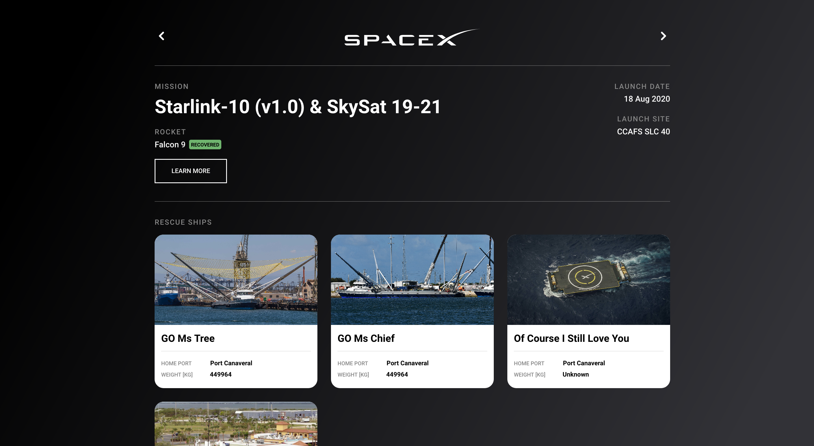

# Exlabs SpaceX Task Solution



<h3 align="center"><a href="https://exlabs-spacex-task.vercel.app/" target="_blank">🎉 Live Demo</a></h3>

## Description

<p>React & TypeScript-based client for viewing latest completed SpaceX missions. Solution for <a href="https://exlabs.com/">exLabs</a> recruitment task.
</p>

<h3>Main features:</h3>
<ul>
    <li>Dynamic rendering data from SpaceX API, using React and Apollo client</li>
    <li>Separate style modules made with styled-components</li>
    <li>Responsive-scaling according to RWD standards</li>
</ul>

## General Usage

### Installation

To install all related packages run:

```sh
npm install
```

To enable husky run:

```sh
npm run prepare
```

### Development

To run the app on a local server use:

```sh
npm run start
```

Linting with Eslint, to check for any TypeScript/JavaScript/React-related errors:

```bsh
eslint '*/**/*.{js,ts,tsx}' --fix
```

To preview the app, open [http://localhost:3000](http://localhost:3000) in the any browser of choice.

### Production

To compile for production build:

```sh
npm run build
```

## Credits

- Original design - [exLabs Team](https://exlabs.com/)
- GraphQl API used - [SpaceX API](https://api.spacex.land/graphql/)
- Tooltip design & code - [Tippy.js](https://atomiks.github.io/tippyjs/v6/getting-started/)
- Loading spinner design & code - [React Epic Spinners](https://www.npmjs.com/package/react-epic-spinners)
- Icons - [Feather Icons](https://feathericons.com)
